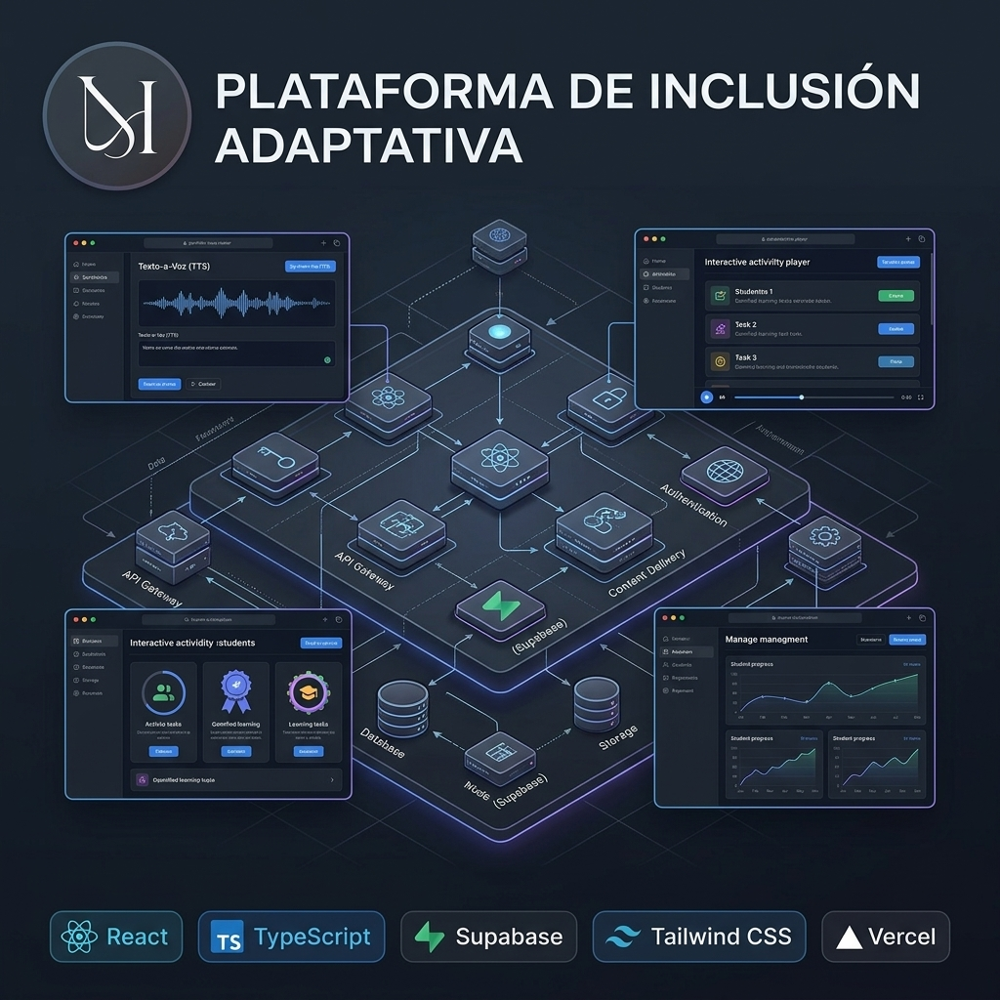
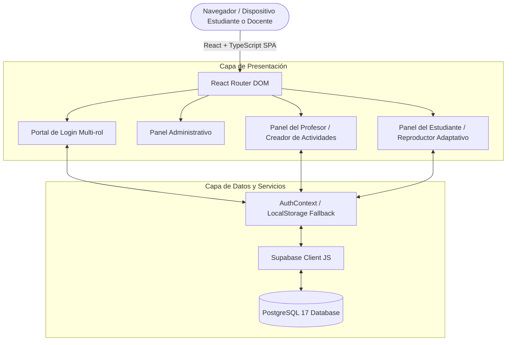

<p align="center">
  
</p>

# ECO INCLUSIVO — Plataforma de Inclusión Educativa Adaptativa

[](https://plataforma-inclusion-adaptativa.vercel.app/login)
[](https://react.dev)
[](https://typescriptlang.org)
[](https://supabase.com)
[](https://tailwindcss.com)
[](https://vercel.com)

> **Sistema web adaptativo para la gestión de educación inclusiva.** Solución integral orientada al cumplimiento de marcos normativos de inclusión educativa (Decreto 1421), proporcionando herramientas de accesibilidad, voz sintética, actividades interactivas adaptadas y seguimiento pedagógico en tiempo real.

- **Demo en vivo:** [plataforma-inclusion-adaptativa.vercel.app/login](https://plataforma-inclusion-adaptativa.vercel.app/login)

---

## 🎯 ¿Por qué existe esta plataforma? (La Problemática)

En el sistema educativo tradicional, los estudiantes con necesidades educativas diversas (discapacidad cognitiva, motora, auditiva o visual) enfrentan barreras severas al interactuar con contenidos académicos estandarizados. 

**Problemas detectados:**
1. **Falta de contenidos adaptados:** Los materiales digitales comunes carecen de síntesis de voz, pictogramas, ajustes de contraste o tipografías accesibles.
2. **Carga administrativa para los docentes:** Elaborar y mantener los Planes Individuales de Ajustes Razonables (PIAR) requiere horas de trabajo manual sin herramientas centralizadas.
3. **Falta de seguimiento objetivo:** Dificultad para medir el progreso real del estudiante de forma cuantitativa y cualitativa.

---

## ⚡ ¿Para qué sirve? (El Propósito y Solución)

**ECO INCLUSIVO** transforma el aula de clase digital permitiendo que cada estudiante consuma el contenido académico según sus capacidades individuales, mientras que los profesores pueden crear, adaptar y monitorear actividades en tiempo real.

### Componentes Clave:
- **Reproductor Adaptativo:** Actividades interactivas con lector de voz sintética (Text-to-Speech), dictado de preguntas, asistencia visual y botones de respuesta simplificados.
- **Creador de Actividades para Docentes:** Editor intuitivo para diseñar evaluaciones de opción múltiple, ordenamiento y preguntas auditivas con felicitación inmediata y feedback positivo.
- **Gestión de Estudiantes y Cursos:** Registro individual de estudiantes por aula (`3A`, `4B`), seguimiento de intentos y almacenamiento seguro en Supabase.
- **Tablero Administrativo:** Métricas globales de uso, control de accesos y auditoría pedagógica.

---

## 🏗️ Arquitectura de la Aplicación



---

## 👥 Paneles y Roles del Sistema

| Rol | Vistas Accedidas | Funcionalidades Principales |
|---|---|---|
| **Estudiante** | `/estudiante`, `/estudiante/actividad/:id` | Reproductor adaptativo con audio-lectura, selección de respuestas visuales, retroalimentación positiva. |
| **Profesor** | `/profesor`, `/profesor/estudiantes`, `/profesor/actividades` | Registro de nuevos estudiantes, creación y edición de actividades educativas por etapa, reporte de progreso. |
| **Administrador** | `/admin` | Gestión de usuarios, métricas de plataforma y configuración global. |

---

## 🛠️ Stack Tecnológico

- **Frontend Core:** React 18, TypeScript, Vite.
- **Estilos & UI:** Tailwind CSS, Lucide React (iconografía accesible).
- **Backend & Base de Datos:** Supabase (PostgreSQL 17, Row Level Security, Auth).
- **Accesibilidad & Audio:** Web Speech API (Síntesis de voz nativa del navegador), soporte para grabador de voz HTML5.
- **Despliegue:** Vercel CI/CD automatizado.

---

## 🔑 Variables de Entorno (`.env`)

```env
# Conexión a Supabase (Opcional - incluye modo mock para pruebas locales)
VITE_SUPABASE_URL=https://tu-proyecto.supabase.co
VITE_SUPABASE_ANON_KEY=eyJhbGciOiJIUzI1NiIsInR5cCI6...
```

---

## 🚀 Inicio Rápido en Local

```bash
# 1. Clonar el repositorio
git clone https://github.com/jd5073356-max/plataforma-inclusion.git
cd plataforma-inclusion

# 2. Instalar dependencias
npm install

# 3. Iniciar el servidor de desarrollo
npm run dev

# 4. Compilar para producción
npm run build
```

---

## 👤 Autor

**Juan David Herrera**  
*AI Automation Engineer | Product Engineer · AI, Systems & Web3*  
Bogotá, Colombia  
- **GitHub:** [@jd5073356-max](https://github.com/jd5073356-max)  
- **LinkedIn:** [linkedin.com/in/juan-david-herrera](https://linkedin.com)
